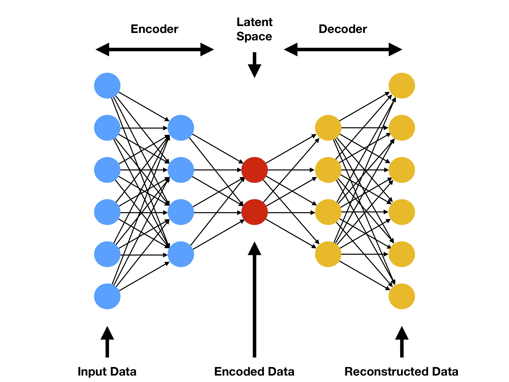
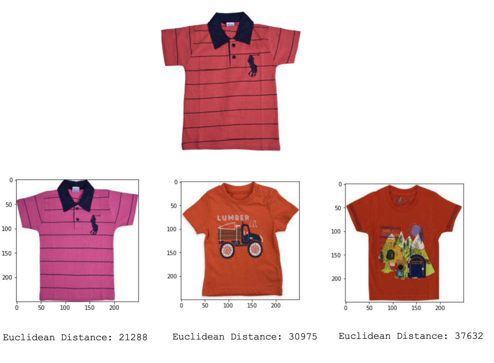

# Querying Similar Images with TensorFlow

Compare two different image search engine approaches developed with Deep Learning. You can found a more comprehensive explanation in this [Medium]() post.

## Requirements
- pandas
- numpy
- tqdm
- requests
- tensorflow==2.3.1
- pillow
- matplotlib

## Motivation

We are going to solve this problem using the [Flipkart](https://www.kaggle.com/PromptCloudHQ/flipkart-products) images dataset.

At first, we train an Autoencoder to compress the image in a smaller dimension, so then we can compute the euclidean distance between the Auutoenconder's Latent Space and any desired picture to find similar ones on FLipkart image dataset. 

The output of the Autoencoder is the reconstruction of the iniput we feed the algorithm. This type of model consists of three main parts: Encoder, Latente Space, and Decoder. We are interested on the Latent Space of the model, given taht we can understand this output as a comnpressed represemntation of the initial image.

## Results

Let's take a look to the top 3 most similar images of the Polo shirt, using the Autoencoder:

